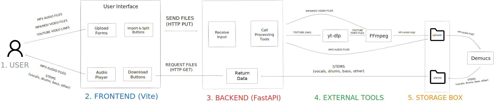

# Stemsmith

AI-powered music processing tool that converts media into isolated audio stems.

Stemsmith is a full-stack web application that allows users to:

- Convert YouTube videos → MP3
- Convert video files (MP4/MOV) → MP3
- Split MP3 files into stems (vocals, drums, bass, other) using Demucs

The system is built with a React frontend and a FastAPI backend. Media files are processed using yt-dlp, FFmpeg, and Demucs, then returned to the client for playback and download.

## Features

- YouTube → MP3 conversion
- Video → MP3 extraction (MP4 / MOV)
- AI stem separation using Demucs
- FastAPI backend for media processing
- Audio playback for generated stems
- Downloadable output files

---

## Project structure

- `frontend/` – React app (Vite) for upload, status, and stem preview UI
- `backend/` – FastAPI app and service layer
  - `main.py` – FastAPI app factory and router wiring
  - `routes/` – API route modules
    - `upload.py` – `POST /api/upload`
    - `split.py` – `POST /api/split/{file_id}`, `GET /api/stems/{file_id}`, `GET /api/download/{file_id}`
  - `services/demucs_service.py` – Demucs stem separation (vocals/drums/bass/other)
  - `services/youtube_service.py` – YouTube import (yt-dlp + FFmpeg)
  - `services/mp4_service.py` – Video → MP3 conversion (FFmpeg)
  - `models/` – Pydantic models (request/response schemas)
  - `utils/` – shared utilities/helpers
- `uploads/` – stored uploaded/imported audio files (MP3)
- `stems/` – generated stem outputs (WAV per stem)

---

## Architecture

Below is the high-level architecture of Stemsmith.



---

### System Overview

Stemsmith is a full-stack music processing application that converts media into usable audio stems.

Workflow:

1. Users upload an MP3, MP4/MOV file, or a YouTube URL through the React frontend.
2. The frontend sends the request to a FastAPI backend.
3. The backend orchestrates media processing using:
   - yt-dlp (download YouTube audio)
   - FFmpeg (media conversion)
   - Demucs (AI-based stem separation)
4. Processed files are temporarily stored and returned to the client.
5. The frontend provides audio playback and download controls for the generated files.

---

## Backend (FastAPI)

**Requirements:** Python 3.10+ is recommended (and required for current yt-dlp support).
The backend does not pin 3.9; use 3.10 or newer for the virtualenv.

### Install dependencies

From the project root:

```bash
cd backend
python -m venv .venv
source .venv/bin/activate  # On Windows: .venv\Scripts\activate
pip install -r requirements.txt
```

### Run the backend

```bash
cd .. # Go back to the Stemsmith project root
uvicorn backend.main:app --reload --host 0.0.0.0 --port 8000
```

The API will be available at `http://localhost:8000` and the interactive docs
at `http://localhost:8000/docs`.

### Key endpoints

- `POST /api/upload` – accept an uploaded audio file and return a `file_id`
- `POST /api/split/{file_id}` – run Demucs stem splitting for an uploaded/imported file
- `GET /api/stems/{file_id}` – list available stems for a given `file_id`
- `GET /api/download/{file_id}` – download a stem WAV by name (query param `stem`)
- `POST /api/import/youtube` – import YouTube audio to MP3 (yt-dlp + FFmpeg)
- `GET /api/import/youtube/diagnose?url=...` – local debugging: dry-run YouTube strategies, no file saved
- `POST /api/import/mp4` – convert uploaded video to MP3 (FFmpeg)
- `GET /api/download-original/{file_id}` – download the original uploaded/imported MP3

---

## Frontend (React)

### Install dependencies

From the project root:

```bash
cd frontend
npm install
```

### Run the frontend dev server

```bash
cd frontend
npm run dev
```

By default, Vite will start the app on `http://localhost:5173`.

The frontend expects the backend to be running on `http://localhost:8000` and
uses the `/api/*` endpoints defined above. You can change the base URL in
`frontend/src/services/api.js` if needed.

---

## AI audio processing (Demucs)

Demucs processing is implemented in:

- `backend/services/demucs_service.py`

At a high level:

- The backend locates the uploaded/imported MP3 in `uploads/`
- It runs Demucs (htdemucs) to generate the 4 standard stems
- It writes stem WAV files to `stems/{file_id}/` and exposes them via download/list endpoints

---

## Troubleshooting

### YouTube import: common failures

YouTube often requires **cookies and/or attestation (PO Token / SABR)** for some videos.
Forcing a single client (e.g. `web_embedded`) is **not a universal fix**: some videos
work with the default client, others need browser cookies, and others fail with
embedding or session errors.

**Failure modes (different causes):**

- **403 Forbidden** – YouTube blocked the download request (IP/client/rate limits).
- **Error 152 - 18 / “Watch video on YouTube”** – Video cannot be played in the
  embedded player; try another public video or use browser-cookie fallback.
- **“The page needs to be reloaded”** – Playback session rejected; cookies or
  updated yt-dlp often help.
- **Age / login required** – Video needs a signed-in YouTube session (cookies help).
- **PO Token / SABR** – YouTube is using attestation; newer yt-dlp and/or cookies
  may be required.

**Recommended setup:**

1. **Python 3.10+** – The project and yt-dlp recommend Python 3.10 or newer.
   Python 3.9 is deprecated for yt-dlp and some fixes require 3.10+.

2. **Update yt-dlp regularly** – YouTube changes often; use a recent or nightly build:
   ```bash
   pip install -U yt-dlp
   # or: brew upgrade yt-dlp
   ```

3. **Chrome cookie fallback** – For many YouTube videos (403, reload, or 152-18),
   the backend may need browser cookies. **Chrome cookie fallback is often required.**
   To enable it, set:
   ```bash
   YTDLP_COOKIES_FROM_BROWSER=chrome
   ```
   (Copy from `.env.example` or export in your shell.) The app will then try
   default, then default+Chrome cookies, then web_safari, web_safari+cookies,
   web_embedded, web_embedded+cookies. Safari cookie extraction may fail on macOS
   due to permissions; use Chrome (or Firefox) if that happens.

4. **Manual test** – To see exactly how yt-dlp behaves for a URL:
   ```bash
   yt-dlp -vU "https://www.youtube.com/watch?v=..."
   yt-dlp -vU --cookies-from-browser chrome "https://www.youtube.com/watch?v=..."
   ```

5. **Local diagnostic** – Call the backend diagnostic endpoint (no file is saved):
   ```text
   GET /api/import/youtube/diagnose?url=https://www.youtube.com/watch?v=...
   ```
   Response includes which strategies were tried, exit codes, classifications,
   and the user message that would be shown on full import failure.